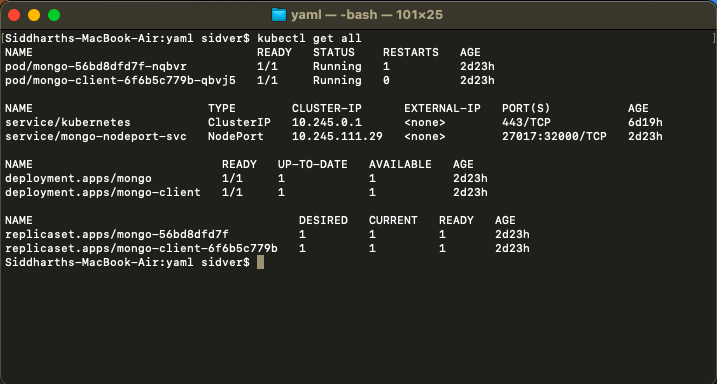

# Deploy MongoDB Cluster on Kubernetes
## _Deploy MongoDB Cluster on DigitalOcean Kubernetes_

You can easily deploy scalable NoSQL database cluster on DigitalOcean Kubernetes Platform.
Some prerequisites:
- Git installed on your system
- [kubectl](https://kubernetes.io/docs/tasks/tools/) commandline tool installed
- doctl( [How to install and setup doctl ?](https://docs.digitalocean.com/reference/doctl/how-to/install/) )

## Getting Started
In this writeup you will get to know how to deploy NoSQL(MongoDB) Cluster on DigitalOcean Kubernetes (DOKS).
First Signup to DigitalOcean if you havn't already. Signup with the above button to get joining free $100 credit to your account.

Go to Kubernetes Section
<br />


Select "create new cluster"

Fill out the form and your cluster will be setup within few minutes.
<br />


Now till here we have successfully created our cluster and now we will setup mongoDB in the cluster we made.

## Deploying MongoDB
I am using MacOS here. So lets open the terminal.

```sh
git clone https://github.com/arpan45/mongodb-cluster-kubernetes.git
cd mongodb-cluster-kubernetes
```

To install kubectl lets use Homebrew so run the command

```sh
brew install kubectl
```

Then to check the version you installed run the command

```sh
kubectl version --client
```

You must have kubectl installed in your system
<br /><br />


The number of replicas and other setup in mongodb-deployment.yaml file can be changed upon one's perspective.

```sh
apiVersion: apps/v1
kind: Deployment
metadata:
  labels:
    app: mongo
  name: mongo
spec:
  replicas: 1
  selector:
    matchLabels:
      app: mongo
  strategy: {}
  template:
    metadata:
      labels:
        app: mongo
    spec:
      containers:
      - image: mongo
        name: mongo
        args: ["--dbpath","/data/db"]
        livenessProbe:
          exec:
            command:
              - mongo
              - --disableImplicitSessions
              - --eval
              - "db.adminCommand('ping')"
          initialDelaySeconds: 30
          periodSeconds: 10
          timeoutSeconds: 5
          successThreshold: 1
          failureThreshold: 6
        readinessProbe:
          exec:
            command:
              - mongo
              - --disableImplicitSessions
              - --eval
              - "db.adminCommand('ping')"
          initialDelaySeconds: 30
          periodSeconds: 10
          timeoutSeconds: 5
          successThreshold: 1
          failureThreshold: 6
        env:
        - name: MONGO_INITDB_ROOT_USERNAME
          valueFrom:
            secretKeyRef:
              name: mongo-creds
              key: username
        - name: MONGO_INITDB_ROOT_PASSWORD
          valueFrom:
            secretKeyRef:
              name: mongo-creds
              key: password
        volumeMounts:
        - name: "mongo-data-dir"
          mountPath: "/data/db"
      volumes:
      - name: "mongo-data-dir"
        persistentVolumeClaim:
          claimName: "mongo-data"

```
Lets run this command to deply yaml files

```sh
kubectl apply -f .
```

The output will be something like this
<br />

<br />
So everything is deployed

To check whether everything till now is working perfectly of not run this command in the terminal.
```sh
kubectl get all
```

<br />
As we can see that our mongoDB cluster is now setup and working correctly. Now we enter the bash shell of our mongo-client

```sh
kubectl exec deployment/mongo-client -it -- /bin/bash
```

<br />
Now we can access our mongo shell via noodeport

> Note: Make sure you have changed the username and password in the 'mongodb-secrets.yaml' file.

```sh
mongo
```


Yee ! We have successfully logged in to our mongo shell. We can test everything is working by inserting a document in a collection.

<br />


## License

MIT

## Credits
https://devopscube.com/deploy-mongodb-kubernetes/
